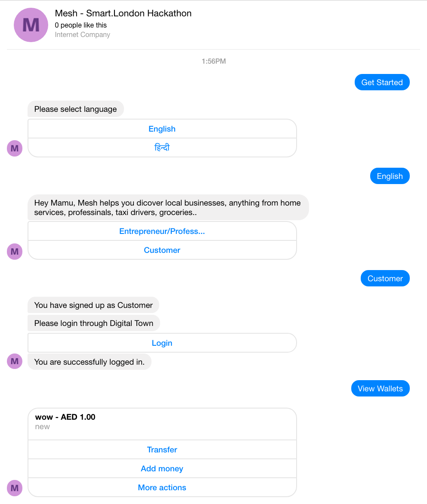

Full Demo: https://www.youtube.com/playlist?list=PLQcGlLJQrlIDnTEr0Ib3yXLJn9XU5EVum

# Pitch
Mesh helps you dicover local businesses, anything from home services, professinals, taxi drivers, groceries, houses on rent OR You can sign up as one of them and let your clients discover you.

# What it does:
Consider Mesh as bridge between you and local businesses. It leverage various chatbot platforms to connect both. Anything from booking cab, renting a house, buying grocery, getting home services, finding nearby professional, you can do it through Mesh

# Major Features:

1. Complete control over your Digitaltown wallet.(Transfer money between wallets, actions like delete/update/deactivate) It consumes almost all Digitaltown Wallet APIs 
2. Onboarding Process if you signup as Business. In case of drivers, Platform would take details like car license number, addtional car details. In case of renting house, it will ask for house photos, amenities etc. For store owners, it will ask all items which sell by them, whether they do delivery or not etc.
3. Keep Context between various platform. For example: You are interacting with chatbot on deskop through FB Messenger, you leave conversation midway and go to Telegram on your mobile. You wont have to start conversation again! Bot will keep context of last conversation. This is possible because of Digitaltown SSO 
4. Easy send money to your friends/family. They just have to mention email address and amount. You can just type "Send money"/"Receive money", send email, amount and you are done!   
5. Multilingual - I18n is supported and can scale through any number of languages

# Other Feature: 

1. Supports Facebook Messagers persistent-menu for additional actions
2. Easy configuration when adding new business/services/professions/grocery items etc.
3. Call button incase user wants to connect
4. Supports webview on all platforms. It provides best in-app experience while being redirect to external services (Very much useful when authorizing for Digitaltown SSO)
5. Uses location to discover nearby stores/businesses
6. Easily Scalable

# Where Idea came from:
I moved to new area recently in the same city(Mumbai). One of the problem me and my family facing was finding local vendor/store for things like household items, grocery, home services etc. Google wouldn't return much answers when it comes to small stores like dairy, general stores and home services. Ordering online won't work when you need any item immediately, espacially in developing countries like India where people not much active online expect messenger services like Facebook Messenger, Telegram etc. For any small businesses/stores it is difficult to build their own platform where they can receive orders online, discover clients easily or receive/send payments. Bot platform can be answer to those questions and With advantage of DigitalTown platform, Using its SSO and Wallet API it will be very simple to solve those problems. 

# How it can impact society:
User acquisition is very fast when it comes to bot platform. It will move trend towards local businesses when it comes to Online experience, also it's completely free to use and open sourced, which will shift power from big cos like Amazon, Uber, Airbnb and other similar giants to local vendors. This will every city self contained and its win-win for all.

# How I built it
I wrote down all the major features, user flows, ideas I had in my mind.

# Challenges I ran into
Data modelling was quite complicated. Setting up bot, webhooks took much of my time. Also Desiging architecture which supports multiple bot platforms

# Accomplishments that I'm proud of
Being able to implement features/ideas I had

# What I learned
This is by far best project I have worked on. It involved web server, bot apis and talking to Digitaltown's services. I implemented SSO for the first time so that was major area where I learned alot

# What's next

NLP can be the next step. Bots should be able to understand in natural language while onboarding or while talking to users (Most of flows are call-to-action based). 
One good feature will be Proxy messaging where you can chat with other through Mesh - instead of directly sharing number. This will be for professionals which are on platform without loosing privacy.
Feature are very basic, I would say what I have implemented is 0.01% of what it can be so theres alot of work to do :)

# Screenshots

